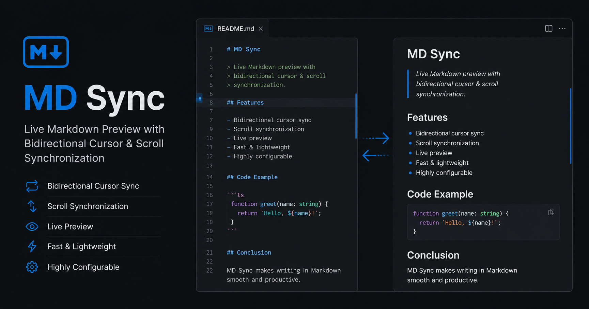

# MD Sync

<p align="center">
  
</p>

<p align="center">
  <strong>Live Markdown Preview with Bidirectional Cursor & Scroll Synchronization</strong>
</p>

<p align="center">
  Write Markdown faster with a synchronized side-by-side preview that keeps your editor and preview perfectly aligned.
</p>

<p align="center">
  
  
  
  
</p>

---

# Features

## 🚀 Live Markdown Preview

Open a live Markdown preview beside your editor that updates instantly as you type.

## 📍 Bidirectional Cursor Synchronization

Move the cursor in the editor and the preview follows automatically.

Click inside the preview and the editor jumps to the corresponding Markdown location.

## 📜 Bidirectional Scroll Synchronization

Scrolling either the editor or the preview keeps both panes aligned, making it easy to navigate large Markdown documents.

## ✅ GitHub-Flavored Markdown

Supports:

* Headings
* Tables
* Task Lists
* Code Blocks
* Inline Code
* Links
* Images
* Blockquotes
* Lists

## 🎨 Syntax Highlighting

Beautiful syntax highlighting for fenced code blocks.

## ⚡ Lightweight

* Fast startup
* Minimal memory usage
* Native VS Code experience
* No unnecessary UI

---

# Installation

Install **MD Sync** from the Visual Studio Marketplace.

Or search for:

**MD Sync**

---

# Usage

Open any Markdown (`.md`) file.

Launch the preview using one of the following:

* **Editor Toolbar** → **Open Preview Side by Side**
* **Command Palette**

```
MD Sync: Open Preview Side by Side
```

### Keyboard Shortcut

**Windows / Linux**

```
Ctrl + Alt + V
```

**macOS**

```
Cmd + Alt + V
```

---

# Why MD Sync?

The built-in Markdown preview is great for viewing documents, but keeping the editor and preview synchronized while editing long files can be challenging.

MD Sync keeps both views aligned, allowing you to focus on writing instead of constantly scrolling to find your place.

Perfect for:

* README files
* Documentation
* Technical blogs
* Notes
* Wikis
* Knowledge bases

---

# Requirements

* Visual Studio Code 1.85 or later

---

# Roadmap

Planned improvements include:

* Mermaid diagram support
* Math (KaTeX) support
* Table of Contents
* Export to HTML/PDF
* Additional preview themes
* Performance enhancements

---

# Contributing

Contributions, bug reports, and feature requests are welcome.

If you have an idea or find an issue, please open one on the project's GitHub repository.

---

# License

MIT License
